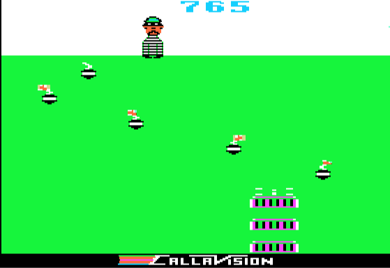
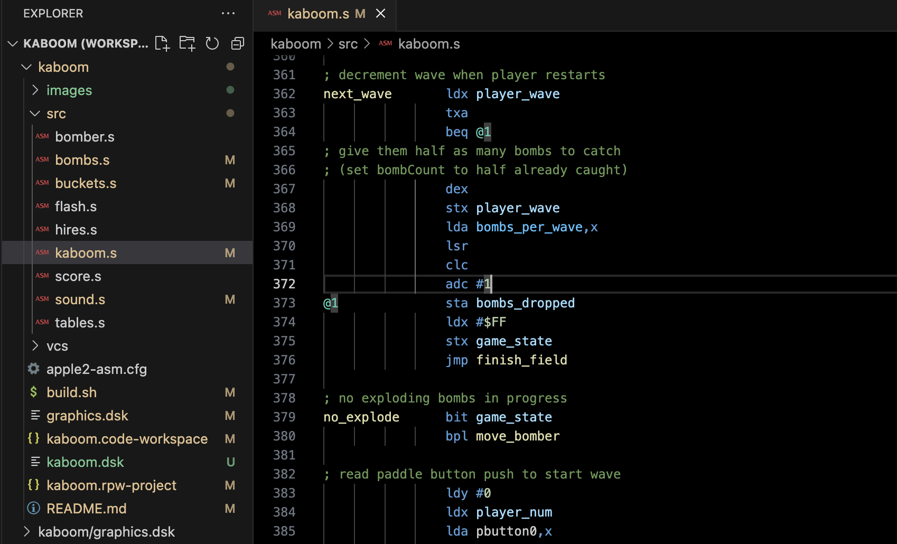
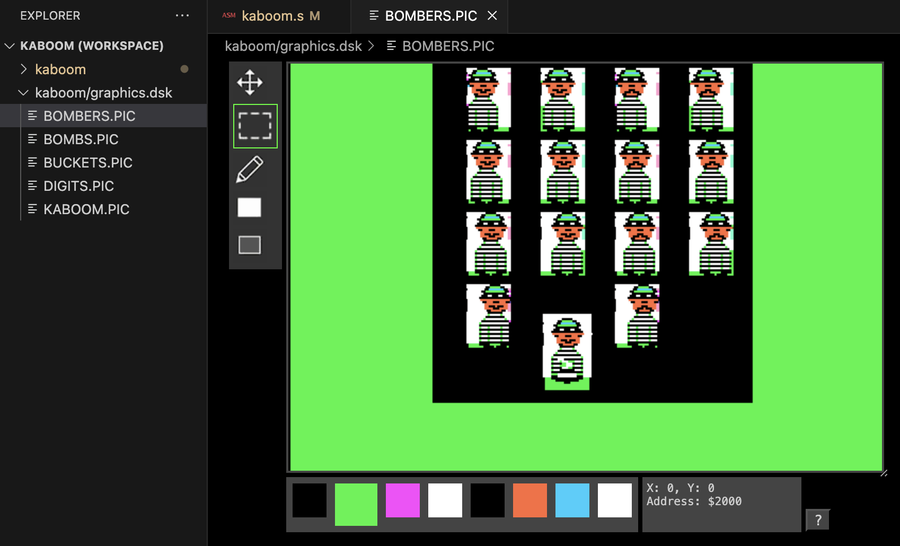
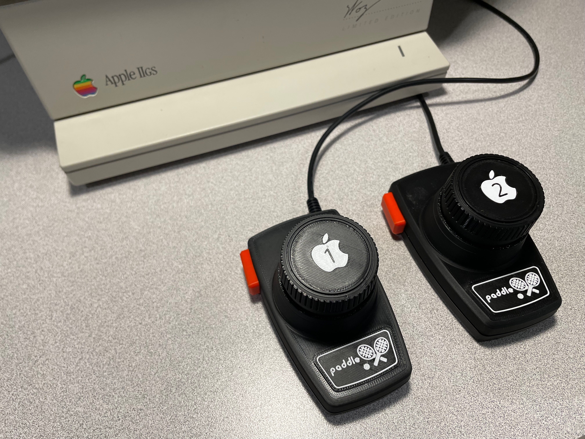

# Apple II Kaboom!



## Instructions
```
  S: Select Game
     Game 1: You vs. the Mad Bomber
     Game 2: You and a friend
      take turns vs. the Mad Bomber

  R: Reset to start a new game

  Paddle 0: Player 1 controller
  Paddle 1: Player 2 controller
  Paddle button starts bombs falling

  (Mockingboard required for sound)
```
## Hardware vs. Emulators

Running on actual hardware with good paddles with a Mockingboard sound card is highly recommended.  It's the only real way to achieve Kaboom! game play "flow" as experienced on an Atari 2600.

If an Apple II emulator is used, it must emulate the floating bus ("vapor lock") of real hardware. AppleWin and Virtual II support it but, as of this writing, MicroM8 does not and will hang after launch.

## Design

This implementation of Kaboom! uses algorithms taken directly from the disassembled Atari 2600 ROM code (see vcs/kaboom.a), with the goal of matching original game play as closely as possible.  Graphics were designed based on the Atari graphic bitmaps as well.

The code was written with high performance in mind in order to run at a solid 60fps.  To keep the framerate consistent, optimizations were omitted that only helped in some cases.  The code runs at worst-case speed but great effort was made to make the worst-case as fast as possible.

Sound is only provided when Mockingboard hardware/emulation is present.  An attempt was made to implement software sound but too few cycles were left per frame to create accurate sound effects.  Dropping to 30fps may have made software sound possible but would have degraded game play and compromised the primary goal of duplicating the original game.

## Development

The code was developed using the Visual Studio Code editor.  Syntax highlighting and editing assistance was provided by [RPW 65](https://marketplace.visualstudio.com/items?itemName=seanahan5000.rpw65).



All graphics were created and edited using [RPW A2](https://marketplace.visualstudio.com/items?itemName=seanahan5000.rpwa2).  This extension adds a file system provider for mounting .dsk images and a HIRES graphics editor.



The code was assembled using ca65, mainly because I wanted to familiarize myself with it and compare it to Merlin, dasm, etc.  (I'm not really a fan, to be honest -- no HEX directive, required config files, and seeming problems with code that uses alignment directives.)

Finally, the game was debugged using the RPW debugger.  This is a web-based Apple II emulator and debugger written in TypeScript that has not been release as of this writing.  It will eventually be converted to a VSCode extension and released on the marketplace.

## Paddles

Custom paddles can be created in order to enjoy Kaboom! in the way it was meant to be played, but note that standard Apple paddles will also work just fine too.



Building these Apple-compatible paddles is mostly an exercise left to the reader.  Below are links and descriptions to the 3D models I designed and the parts needed to build them.

#### Materials

* 3D printed parts

    https://www.thingiverse.com/thing:6725944

* 150K potentiometer

    https://www.mouser.com/ProductDetail/858-P2301FD20BR150K

* Four conductor cable, 26 AWG each, 4mm outer radius

    Search amazon.com for
    "26AWG UL2464 Power Cable Stranded Electrical Wire Flexible LED Red & Black & Yellow & White 4 Conductors 25ft"

* Cherry MX keyboard switch

    MX Black or preference

* Compression spring (optional)

    10mm outer dimension, 0.5mm wire, 10mm length

* Cord strain reliever

    4mm inner radius

* DB-9 male connector

    Search amazon.com for
    "DB9 Solderless Connector 4Male, DB9 Breakout Connector RS232 D-SUB Serial to 9pin Port Terminal with Case"

* 580 Ω resistor (up to 1KΩ okay)


#### Wiring

Assuming Yellow and Black wires connect to potentiometers and White and Red connect to buttons, connect the wires to the DB9 pins as follows:


Use this wiring information at your own risk!

```
Wire -> DB9 Pin
----    ---
 Y0  ->  5
 B0  ->  2
 R0  ->  2
 W0  ->  7
 Y1  ->  8
 B1  ->  2
 R1  ->  2
 W1  ->  1

580 Ω resistor from Pin 1 -> 3
580 Ω resistor from Pin 7 -> 3
```
